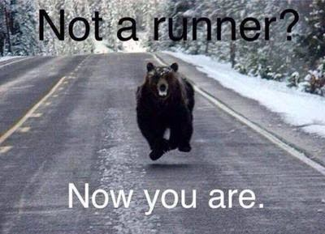

```{r setup, include=FALSE}
knitr::opts_chunk$set(echo = FALSE)

library(dplyr)
library(plotly)

```

## Task
1. Create a web page presentation using R Markdown that features a plot created with Plotly. 
2. Host your webpage on either GitHub Pages, RPubs, or NeoCities. 
3. Your webpage must contain the date that you created the document, and it must contain a plot created with Plotly.

## Dataset
```{r load, include = F}
load(file = "data/myRunData.rda")

data <- df %>%
  select(date, pace, ascent, maxHR, weekday) %>%
  mutate(pace = 60/pace)

data <- as.data.frame(data)

```

The dataset represents John Doe's running workouts over 7 months. 

```{r data}
head(data, n = 6)

```

## Go up or go fast.

This plot shows John's trade-off between running hills and running fast. The redder and larger the circle, the more effortful the run was.

```{r plot, warning = F, comment = F, error = F}

g <- ggplot(aes(x = pace, y = ascent, date = date), data = data) + 
  geom_point(aes(size = maxHR, colour = maxHR), alpha = 0.5) +
  xlab("Pace [km/h]") +
  ylab("Ascent [m]") +
  scale_size(range = c(1,15), guide = F) +
  scale_colour_gradient(low = "blue", high = "red") +
  theme_bw()

ggplotly(g, tooltip = c("date", "pace", "ascent"))
```

## Thank you!
<center>
{width=60%}

<font size="1">Source: http://3.bp.blogspot.com/-otNgHcWOYyE/U1hrqtk3F_I/AAAAAAAABFk/QpD1Lv15jpI/s1600/runner.jpg</font> 

</center>

