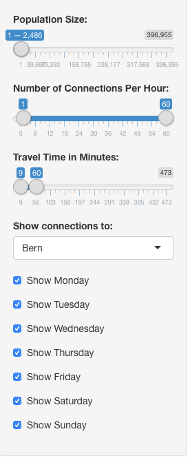

Shiny Work & Travel App Switzerland
========================================================
author: M.Kliesch
date: 04/02/2020
autosize: true

Introduction
========================================================

Do you want to live in Switzerland because of its mountains, lakes and green forests, but happen to work in one of the major cities?

The "Shiny Work & Travel App Switzerland" is your friend. It helps you locate suitable towns and villages in Switzerland that are limited in population size but still have direct public transport connections to Bern or Zurich.

The Dataset
========================================================

The dataset used for the app is based on 
> 1. the last national census of Switzerland and 
> 2. the most recent public transport schedule provided by the Swiss SBB federal railway. 

It was modified to show the number of connections per hour to Zurich/Bern and the average duration it takes to reach them.

The Dataset II
========================================================


<small>

```r
str(dat)
```

```
FALSE 'data.frame':	4 obs. of  8 variables:
FALSE  $ name         : Factor w/ 333 levels "Aadorf","Aarau",..: 224 147 281 162
FALSE  $ lat          : num  47.2 47.2 46.9 47.1
FALSE  $ lng          : num  8.7 7.79 7.85 8.31
FALSE  $ population   : int  13198 15447 1425 81295
FALSE  $ toZhPerHMon  : num  9.32 1.33 0 9.84
FALSE  $ toBernPerHMon: num  0 2.68 2.18 8.51
FALSE  $ avDurToZh    : num  36 55.5 NA 54.8
FALSE  $ avDurToBern  : num  NA 51 42 81
```
</small>

Example
========================================================

This is what the app will return when looking for villages with fewer than 2000 inhabitants that have direct connections to Bern:

<div style="float: left;">

</div>

<div style="float: right;">

</div>

Link to the App
========================================================

This is where you can test the Work & Travel App Switzerland:

<a href="https://spaghetticode.shinyapps.io/SBB_Schedule/"> https://spaghetticode.shinyapps.io/SBB_Schedule/</a>
